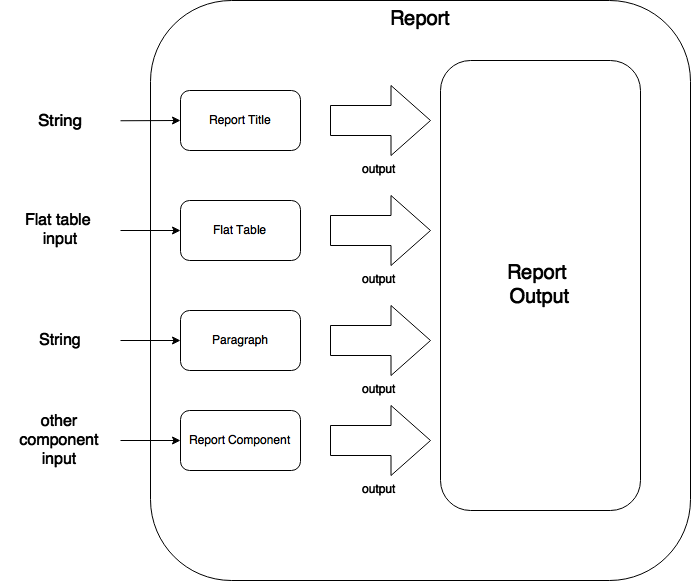

= How to add Katechaki to your project?

== Using Maven

```xml
    <dependency>
    <groupId>net.sf.reportengine</groupId>
    <artifactId>reportengine</artifactId>
    <version>0.13.2</version>
    </dependency>
```

= What is a Report?

A report is a collection of components displayed in the report output.

= Report Components

An example of a report component could be: the title of the report, a paragraph, a table inside the report or a pivot table. Below you’ll find a simple report with multiple components:


The average salary per country

[cols=",,",options="header",]
|=============================================================
| Country | Population | Salary
|Burma |300 |234
|Uganda |100 |134
|Papua |34 |56
|Virgin Islands |5 |1004
|=============================================================

Table : a report with 4 components (a title, a table, an empty line and a paragraph)

Each report component has an input (with the exception of the empty line) and uses the output of the report to display itself:



Now, let’s discuss the report output (the other mandatory setting of a report)…

= Report Output

Some of the most important output formats for your reports are:

* Html (i.e. HtmlReportOutput class): html output that creates a html page with styles into any java.io.Writer_
```java
ReportOuput output = new HtmlReportOutput(new FileWriter("employees.html"))
```

* Excel (i.e. ExcelXmlReportOutput_): creates an excel-xml output into any _java.io.Writer_
```java
ReportOuput output = new ExcelXmlReportOutput(new FileWriter("empl.xml"));
```
* Pdf (i.e. PdfReportOutput): _
```java
ReportOutput output = new PdfReportOutput(new FileOutputStrem("empl.pdf"));
```
* Png (i.e. PngReportOutput)_
* Tiff (i.e TiffReportOutput)_
* Formatting Objects (i.e. FoReportOutput)_

If the existing outputs don’t cover all your needs, feel free to write your own report output by implementing the _ReportOutput_ interface.

= First view on the source code of a report

As stated previously, any report needs an output and some components. These two attributes of a report should be configured with the help of a ReportBuilder (a helper class provided by ReportEngine for the creation of Reports)
```java
//preparation of output and components

HtmlReportOutput output = new HtmlReportOutput(new FileWriter("Hello.html"));

Paragraph title = new Paragraph("Hello World report");

//report set-up

Report report = new ReportBuilder(output)

.add(title)

.add(… other components …)

…

.build();

//report execution

report.execute();
```

*Note:* no computation is performed, no output is done until you call the report.execute() method.

Now, let’s discuss one by one the report components:

= Paragraph

This is a simple string that will be displayed using your specified text alignment. As you probably guessed, the input for this component is a String and/or a horizontal alignment:
```java
Paragraph infoParagraph = new Paragraph("Census data");

Paragraph title = new Paragraph("This is my report", HorizAlign._CENTER_);
```
Note: you can add as many titles as you like in a report.

We’ve discussed about the report output, we’ve covered a first report component then we’re ready for our first report…


= Hello World report

Now that we’ve seen all aspects of a report (the report, its components and the output) it’s time to build a very simple report:
```java
package net.sf.reportengine.samples;

import java.io.FileWriter;
import java.io.IOException;
import net.sf.reportengine.Report;
import net.sf.reportengine.ReportBuilder;
import net.sf.reportengine.components.Paragraph;
import net.sf.reportengine.out.HtmlReportOutput;

public class HelloWorldReport {

public static void main(String[] args) throws IOException{

    //preparation of output and components

    HtmlReportOutput output = new HtmlReportOutput(new FileWriter("Hello.html"));

    Paragraph title = new Paragraph("Hello World report", HorizAlign.CENTER);

    //report set-up

    Report report = new ReportBuilder(output)
        .add(title)
        .build();

    //report execution
    report.execute();
    }
}
```

It’s time to see two heavy report components: Flat and Pivot Table

= Flat Tables

== What is a flat table?

This is a normal tabular table (don't get confused by its name) whose layout will look like:

[cols=",,",options="header",]
|==================================
|*Header 1* |*Header 2* |*Header 3*
|data 11 |data 12 |data 13
|data 21 |data 22 |data 23
|data 31 |data 32 |data 33
|data 41 |data 42 |data 43
|==================================

In order to work properly, a flat report needs at least the following elements configured (aka the mandatory settings):
* the table input
* data columns

The optional settings of a flat table are:
* group columns
* sorting values
* showing data
* showing totals
* showing grand total


== How to build a Flat Table?

Let’s have a look at the flat table below:

```java
FlatTable table = new FlatTableBuilder(new TextTableInput("population.txt"))
    .addDataColumn(new DefaultDataColumn("Country", 0))
    .addDataColumn(new DefaultDataColumn("City", 1))
    .addDataColumn(new DefaultDataColumn("Population", 2))
    .build();
```

== The Flat Table input

The main input classes are:

* TextTableInput - handles input from text streams of any kind and reads data columns separated by a user-defined separator (comma, tab, semicolon, etc). Let’s see an example below:
```java
TableInput tableInput = new TextTableInput("employees.txt", "\t");
```
The example above builds the input based on a file having as data-separator the TAB character. Now let’s see a more sophisticated use of the TextTableInput class

```java
URL url = new URL("http://www.mysite.com/inputData/expenses.csv");

TableInput tableInput = new TextTableInput(
        new InputStreamReader(url.openStream()),",");
```

* SqlTableInput - executes a query and sends the result as input for any flat table
```java
TableInput sqlInput = new SqlTableInput(
    "jdbc:hsqldb:mem:countriesDB",
    "org.hsqldb.jdbcDriver",
    "user",
    "password",
    "select id, country, region, city, population from DB_TABLE"
);

//This class creates a connection to the database and executes the provided query. In case you want to re-use a connection you should have a look at SqlConnectionBasedTableInput and JdbcResultsetTableInput:

java.sql.Connection dbConnection = ...

TableInput connBasedInput = new SqlConnectionBasedTableInput(
    dbConnection,
    "select id, country, region, city, population from DB_TABLE",
    false);
```

* InMemoryTableInput – this is an array holding the java objects you want to serve as input for your flat table*_
* Custom Input: If the above inputs don’t cover your needs you can always write your own input by extending the AbstractTableInput class.

== Flat Table Columns Configuration

There are two kinds of columns accepted by a flat report: data columns and group columns.

=== Data columns

Data columns are normal report columns used for displaying data and totals. The configurations supported by a data column are:

* header
* values to be displayed
* group calculator (if totals of any kind are needed )
* data formatter
* horizontal/vertical alignment of text
* sorting

Let’s discuss each of these parameters in detail.

==== What is the column header?

It’s the string that will appear in the column header section of the report. In the example below the *Year, Month, Amount* are column headers.

[cols=",,",options="header",]
|===================
|Year |Month |Amount
|2011 |Aug. |500
|2011 |Sept. |300
|2011 |Oct. |134
|===================

==== What values to display?

ReportEngine can be instructed to get data from a specific *input* column or the user can define its own way of getting data. For the moment we will discuss only the default implementation. To customize your own data columns please consult the _*Writing a custom data column*_ section

The default implementation for a data column http://reportengine.sourceforge.net/html/apidocs/net/sf/reportengine/config/DefaultDataColumn.html[net.sf.reportengine.config.DefaultDataColumn] has an inputColumnIndex attribute which tells report-engine which column from your input should be displayed in that column. Using inputColumnIndex you instruct ReportEngine to display your data on the desired position:
```java
new DefaultDataColumn.Builder(0) // builds a column based on the first input column
    .header("Month")
    .build();
```

ReportEngine uses column indexes starting from zero, so zero is our first input column. Another important note: for report-engine, the order in which you define your columns is very important because *it defines the output order of your columns*.

For instance, assuming an input with three columns: year, month and amount spent (like the one presented above in the link:#what-is-the-column-header[“What is the column header ?“] section, I may decide to show the Year column as the third in the final report and show the Month column as the first in the report. To do that I will add my columns in the following order:

```java
//show Month first with data from column 1 (second input column)

//the column will be displayed first because it is added first in the report

table.addDataColumn( column month having inputColumnIndex = 1)

//show Amount second with data from column 2 (third input column)

//the values in the Amount will be displayed second because this

//column is added second

table.addDataColumn(column amount having inputColumnIndex = 2)

//show the Year last with data from the column 0 (first)

table.addDataColumn(column year having inputColumnIndex = 0)
```

==== What is the group calculator?

The group calculator compiles all values of a column in order to get a SUM or an Average or whatever computation comes to your mind. You can use an existing calculator (SUM, AVG, MIN, MAX, COUNT, FIRST, LAST) or you can create your own by implementing the http://reportengine.sourceforge.net/html/apidocs/net/sf/reportengine/core/calc/GroupCalculator.html[net.sf.reportengine.core.calc.GroupCalculator] interface.

==== How to set these properties to a column?

* by using the builder (recommended)
```java
DefaultDataColumn column = new DefaultDataColumn.Builder(0)
    .header("Amount")
    .useCalculator(GroupCalculators.SUM)
    .horizAlign(HorizAlign.LEFT)
    .build();
```

* or by using one of the available constructors (discouraged)
```java
DefaultDataColumn column = new DefaultDataColumn("Month",0,Calculators.SUM);
DefaultDataColumn column = new DefaultDataColumn("Month",0);
DefaultDataColumn column = new DefaultDataColumn(0);
```

=== A report with a flat table

It’s now time to build our first report containing a table: a report showing my expenses during several months. We will use as input http://svn.code.sf.net/p/reportengine/code/trunk/reportengine-samples/inputData/expenses.csv[a file] containing this list of expenses. Our initial target is to create just a simple html report containing all input column and nothing more:

```java
package net.sf.reportengine.samples;

import java.io.FileWriter;
import java.io.IOException;
import net.sf.reportengine.Report;
import net.sf.reportengine.ReportBuilder;
import net.sf.reportengine.components.FlatTable;
import net.sf.reportengine.components.FlatTableBuilder;
import net.sf.reportengine.components.Paragraph;
import net.sf.reportengine.config.DefaultDataColumn;
import net.sf.reportengine.in.TextTableInput;
import net.sf.reportengine.out.HtmlReportOutput;

/**
* this is your first report having the following steps
*
* 1. construct the report output (_html_ in this case)
* 2. construct the flat table having the expenses.csv file as input
* 3. build the report for the output defined in step 1 by adding a title, the previous table
* 5. report execution
*/

public class FirstReportWithATable {

public static void main(String[] args) throws IOException{

//step 1:constructing the report output

HtmlReportOutput reportOutput = new HtmlReportOutput(
        new FileWriter("c:/temp/FirstReportWithATable.html"));

//step 2: constructing a table with 3 columns
FlatTable flatTable =
        new FlatTableBuilder(new TextTableInput("./inputData/expenses.csv",","))
.addDataColumn(new DefaultDataColumn.Builder(0).header("Month").build())
.addDataColumn(new DefaultDataColumn.Builder(1).header("Spent on").build())
.addDataColumn(new DefaultDataColumn.Builder(2).header("Amount").build())
.build();

//step 3: building a report with two components (a title and a flat table)

//FileWriter is used just for demo purposes
Report report = new ReportBuilder(reportOutput)
.add(new Paragraph("My first report", HorizAlign.CENTER))
.add(flatTable)
.build();

//report execution
report.execute();

}
}
```
After executing the code, the result should be an html file like below:

[cols=",,",options="header",]
|=============================
|My first report
|Month | Spent on  | Amount
|August |food |500
|August |gas |300
|September |food |567
|September |gas |154
|September |fun |200
|October |food |345
|October |gas |123
|=============================

Now, there are some things we can improve, for instance, the “Amount” column should have its values right-aligned while the other string columns should be left aligned. Let’s see how we can do this:
```java
import java.io.FileWriter;
import java.io.IOException;
import net.sf.reportengine.Report;
import net.sf.reportengine.ReportBuilder;
import net.sf.reportengine.components.FlatTable;
import net.sf.reportengine.components.FlatTableBuilder;
import net.sf.reportengine.components.Paragraph;
import net.sf.reportengine.config.DefaultDataColumn;
import net.sf.reportengine.config.HorizAlign;
import net.sf.reportengine.in.TextTableInput;
import net.sf.reportengine.out.HtmlReportOutput;

/**
* the first and the second columns are aligned horizontally
* to left and the third (Amount column) is right aligned
*/

public class ColumnsWithAlignmentReport {

public static void main(String[] args) throws IOException{

FlatTable table =
        new FlatTableBuilder(new TextTableInput("./input/expenses.csv",","))
.addDataColumn(new DefaultDataColumn.Builder(0)
.header("Month")
.horizAlign(HorizAlign.LEFT)
.build())
.addDataColumn(new DefaultDataColumn.Builder(1)
.header("Spent on ?")
.horizAlign(HorizAlign.LEFT)
.build())
.addDataColumn(new DefaultDataColumn.Builder(2)
.header("Amount")
.horizAlign(HorizAlign._*RIGHT*_)
.build())
.build();

new ReportBuilder(
        new HtmlReportOutput(new FileWriter("./ColumnsWithAlign.html")))
.add(new Paragraph("Report with columns aligned", HorizAlign.CENTER))
.add(table)
.build()
.execute();

}
}

```

=== Sorting your column data

Sorting data on a specific column can be easily done by calling one of the sorting methods: sortAsc() , sortDesc() available in the builder of http://reportengine.sourceforge.net/html/apidocs/net/sf/reportengine/config/DefaultDataColumn.Builder.html[DefaultDataColumn].

```java
flatTable.addDataColumn(new DefaultDataColumn.Builder(2)
.header("Amount")
.sortAsc()
.build());
```

=== Programmatically formatting the data

Another useful feature of every type of column is value-formatting. Currently data and group columns can be formatted using String.format() which is called by the framework. You just need to specify the string format as in http://docs.oracle.com/javase/1.5.0/docs/api/java/util/Formatter.html[the specs].

```java
flatTable.addDataColumn(
        new DefaultDataColumn.Builder(2)
.header("Amount")
.*valuesFormatter(*"%.2f"*)*
.build());

flatTable.addDataColumn(
        new DefaultDataColumn.Builder(2)
.header("Birth Date")
.*valuesFormatter(*"%tD"*))*
.build());
```

Please note that totals follow another formatting because they usually have another data type. To format the total values (i.e. those returned by calculators) you need to use the long version of the useCalculator() method as in the example below:

```java
DefaultDataColumn column = new DefaultDataColumn.Builder(0)
.header("Amount")
.useCalculator(GroupCalculators.SUM, "%.2f" )
.horizAlign(HorizAlign.LEFT)
.build();
```

*Group columns*

Group columns are helpful when one needs to group rows in order to show subtotals for each group or just a better display of the data. A correct group configuration consists of:

* adding a group column to the table
* setting a http://reportengine.sourceforge.net/html/apidocs/net/sf/reportengine/core/calc/GroupCalculator.html[GroupCalculator] (like SUM, AVG, MIN, MAX etc.) to at least one of the data columns of the table

Note: there's no limit to the number of data columns that can have http://reportengine.sourceforge.net/html/apidocs/net/sf/reportengine/core/calc/GroupCalculator.html[GroupCalculator]s.

Let’s see an example with my monthly expenses. For the input:

[cols=",,,",options="header",]
|=======================
|August | |food |500$
|August | |gas |300$
|September | |food |567$
|September | |gas |154$
|September | |fun |200$
|=======================

If we declare the first column as a group column and we add a http://reportengine.sourceforge.net/html/apidocs/net/sf/reportengine/core/calc/GroupCalculators.html[Sum calculator] to the last data column then ReportEngine will make sure to display the sub totals at each change in the values of the first column:

[cols=",,",options="header",]
|===========================
|August |food |500$
|August |gas |300$
|*Total August* | |*800$*
|September |food |567$
|September |gas |154$
|September |fun |200$
|*Total September* | |*921$*
|*Grand Total* | |*1721$*
|===========================

The full example is presented in the code section below:

```java
import java.io.FileWriter;
import java.io.IOException;
import net.sf.reportengine.Report;
import net.sf.reportengine.ReportBuilder;
import net.sf.reportengine.components.FlatTable;
import net.sf.reportengine.components.FlatTableBuilder;
import net.sf.reportengine.components.Paragraph;
import net.sf.reportengine.config.DefaultDataColumn;
import net.sf.reportengine.config.DefaultGroupColumn;
import net.sf.reportengine.core.calc.GroupCalculators;
import net.sf.reportengine.in.TextTableInput;
import net.sf.reportengine.out.HtmlReportOutput;

/**
* The first report containing a group column.
* The month column is declared as a group column so
* after each change of a month a total will be displayed
* on the Amount column where the calculator has been added
*/

public class FirstReportWithGroups {

public static void main(String[] args) throws IOException {

//constructing a flat table with 3 columns: first is declared as a group column

//the third contains the group calculator (in this case an SUM)

FlatTable flatTable = new FlatTableBuilder(new TextTableInput("./input/expenses.csv",","))
    .addGroupColumn(new DefaultGroupColumn.Builder(0).header("Month").build())
    .addDataColumn(new DefaultDataColumn.Builder(1).header("On What?").build())
    .addDataColumn(new DefaultDataColumn.Builder(2)
    .header("Amount")
    .useCalculator(GroupCalculators.SUM)
    .build())
    .build();

//building and executing the report
        new ReportBuilder(new HtmlReportOutput(
                new FileWriter("./target/MonthlyExpensesUsingGroups.html")))

.add(new Paragraph("Monthly Expenses", HorizAlign.CENTER))
.add(flatTable)
.build()
.execute();

}

}

//Let me draw your attention on the way we defined the Month column as a group column:

.addGroupColumn(new DefaultGroupColumn.Builder(0) //input col. idx
.header("Month")
.build());

//Don’t forget, calculators are specific to data columns not to group columns, that’s why, in the previous example, we’ve added the SUM to a data column:

flatTable.addDataColumn(new DefaultDataColumn.Builder(2)
.header("Amount")
.useCalculator(GroupCalculators.SUM)
.build());
```

The result of your first report containing a group should be something like:


*Monthly Expenses*

[cols="",options="header",]
|================================
| Month | On What? | Amount
|August |food |500
| |gas |300
|Total August | |800
|September |food |567
| |gas |154
| |fun |200
|Total September | |921
|October |food |345
| |gas |123
|Total October | |468
| Grand Total  | |2189
|================================

Other setting available to the group columns are:

* Setting the priority of the group column (useful when more group columns are set to the table
* Setting the header of the column
* Setting the format of the displayed values
* Horizontal and vertical alignment
* Displaying the duplicated values
+
Let’s see some of these settings at work in the example below.

=== More on totals and groupings

Now, let’s see a more complex example: my yearly expenses report, a report having 2 group columns and 2 data columns with totals.

Here’s a list of my expenses over two years (simplified for clarity):

[cols=",,,",options="header",]
|==========================
|2011 |August |food |500
|2011 |August |gas |300
|2011 |September |food |567
|2011 |September |gas |154
|2011 |September |fun |200
|2012 |January |food |205
|2012 |January |gas |100
|2012 |February |food |301
|2012 |March |fun |302
|==========================

Let’s build a report that will show the totals spent for each year and month. For this we have to declare the first and the second columns (year and month) as group columns and add a SUM calculator on the last column (last is actually 3 as the count starts from 0).

It’s time to introduce another attribute of the group columns: the group level which helps ReportEngine prioritize between multiple group columns. If the table has only one group column this parameter is not important but if you have more than one groups then the group level becomes important. The next section will further clarify this:

```java
new DefaultGroupColumn.Builder(1) //1 is the input column index
.header("Month")
.level(2) //2 - is the grouping level
.build());
```

The source code for such a report should look like:

```java
import java.io.FileOutputStream;
import java.io.IOException;
import net.sf.reportengine.Report;
import net.sf.reportengine.ReportBuilder;
import net.sf.reportengine.components.FlatTable;
import net.sf.reportengine.components.FlatTableBuilder;
import net.sf.reportengine.components.Paragraph;
import net.sf.reportengine.config.DefaultDataColumn;
import net.sf.reportengine.config.DefaultGroupColumn;
import net.sf.reportengine.config.HorizAlign;
import net.sf.reportengine.core.calc.GroupCalculators;
import net.sf.reportengine.in.TextTableInput;
import net.sf.reportengine.out.PdfReportOutput;

public class YearlyExpenses {

public static void main(String[] args) throws IOException {

FlatTable table =
        new FlatTableBuilder(new TextTableInput("./input/yearlyExpenses.txt","\t"))

//groups configuration
.addGroupColumn(new DefaultGroupColumn.Builder(0)
.header("Year")
.horizAlign(HorizAlign._*LEFT*_)
.level(0)
.build())
.addGroupColumn(new DefaultGroupColumn.Builder(1)
.header("Month")
.horizAlign(HorizAlign._*LEFT*_)
.level(1)
.build())

//data columns
.addDataColumn(new DefaultDataColumn.Builder(2)
.header("Spent on")
.horizAlign(HorizAlign._*LEFT*_)
.build())

.addDataColumn(new DefaultDataColumn.Builder(3)
.header("Amount")
.horizAlign(HorizAlign._*RIGHT*_)
.useCalculator(GroupCalculators._*SUM*_, "%.2f")
.build())
.build();

//build and execute the report
        new ReportBuilder(
                new PdfReportOutput(new FileOutputStream("./YearlyExpensesReport.pdf")))

.add(new Paragraph("Yearly expenses report", HorizAlign._*CENTER*_))
.add(table)
.build()
.execute();

}

}
```

Note: the second data column contains a SUM calculator which will compute the amount spent on that specific month/year. The output should be a pdf file like:


*Yearly expenses report*

[cols=",,,",options="header",]
|=========================================
| Year  | Month | Spent on  | Amount
|2011 |August |food |500
| | |gas |300
|Total August | | |800.00
|2011 |September |food |567
| | |gas |154
| | |fun |200
|Total September | | |921.00
|Total 2011 | | |1721.00
|2012 |January |food |205
| | |gas |100
|Total January | | |305.00
|2012 |February |food |301
|Total February | | |301.00
|2012 |March |fun |302
|Total March | | |302.00
|Total 2012 | | |908.00
|*Grand Total * | | |*2629.00*
|=========================================

Let’s see one more time the groupings:

```java
.addGroupColumn(new DefaultGroupColumn.Builder(0) //input column index
.header("Year")
.level(0) //group priority
.build())
.addGroupColumn(new DefaultGroupColumn.Builder(1) //input column index
.header("Month")
.level(1) //group priority
.build())
```

Now let’s discuss the group level (or group priority): in the previous configuration the year group takes precedence over the month group. How is this translated into the report? When a change in the year happens then not only the totals for the year are shown but also the totals for the month as in the extract from the final result shown previously:

[cols=",,,",options="header",]
|==============================
|*Total December* |* * | |*921*
|*Total 2011* |* * | |*1721*
|==============================

=== What if my input data doesn’t have the group columns sorted

In order to perform correct groupings the ReportEngine needs all data on group columns to be sorted. Usually the data comes sorted already (especially from sql queries where a simple “order by” statement can solve the ordering). If your group columns data is not sorted already you should inform ReportEngine about this by calling the sortValues() method from the builder of the FlatTable. This way, the reporting mechanism will programmatically sort your values:

```java
import java.io.FileWriter;
import java.io.IOException;
import net.sf.reportengine.Report;
import net.sf.reportengine.ReportBuilder;
import net.sf.reportengine.components.FlatTable;
import net.sf.reportengine.components.FlatTableBuilder;
import net.sf.reportengine.components.Paragraph;
import net.sf.reportengine.config.DefaultDataColumn;
import net.sf.reportengine.config.DefaultGroupColumn;
import net.sf.reportengine.config.HorizAlign;
import net.sf.reportengine.core.calc.GroupCalculators;
import net.sf.reportengine.in.TextTableInput;
import net.sf.reportengine.out.HtmlReportOutput;

/**
* When using group columns, the data in those columns needs to be sorted
* otherwise the report engine will see a change of group in every row.
* In this example, the input data for the flat table is not sorted and
* the report engine is informed about this by using the sortValues() method
*/

public class UnsortedGroupValues {

public static void main(String[] args) throws IOException {

FlatTable table = new FlatTableBuilder(new TextTableInput("./input/unsortedExpenses.csv",","))
    .sortValues() //inform reportengine that it has to sort the values
    .addGroupColumn(
        new DefaultGroupColumn.Builder(0)
            .header("Month")
            .horizAlign(HorizAlign.LEFT)
            .build()
    )
    .addDataColumn(
        new DefaultDataColumn.Builder(1)
            .header("On What?")
            .horizAlign(HorizAlign._*LEFT*_)
            .build()
    )
    .addDataColumn(
        new DefaultDataColumn.Builder(2)
            .header("Amount")
            .useCalculator(GroupCalculators.SUM)
            .horizAlign(HorizAlign.RIGHT)
            .build()
    )
    .build();

    //build and execute the report
    new ReportBuilder(
        new HtmlReportOutput(
            new FileWriter("./target/MonthlyExpensesFromUnsortedInput.html")))
        .add(new Paragraph("Monthly Expenses", HorizAlign.CENTER))
        .add(table)
        .build()
    .execute();
}
}
```

= Pivot (or Crosstab) tables

== What is a pivot table?

Pivot tables are particular types of tables where data is arranged as a 2 dimensional table. Let’s go back to our first example: the monthly expenses report. As a flat report this used to look like this:

[cols=",,",]
|=============================
|*Month* |*Spent on* |*Amount*
|August |food |500
|August |gas |300
|September |food |567
|September |gas |154
|September |fun |200
|=============================

Note that all values in the second column repeat themselves. Wouldn’t it be easier to follow and compare data if those would have been arranged like in the table below?

[cols=",,,",options="header",]
|=============================
|*Month* |*food* |*gas* |*fun*
|August |500 |300 |0
|September |567 |154 |200
|=============================

Think about a situation where you’d have much more data. Arranged in a pivot table all your data is much easier to follow and compare but this is only possible when the values in the column you want as header repeat themselves. Otherwise the column header would be much longer and it wouldn’t allow you to compare the values.

== What I have to set up for a Pivot table?

The pivot table accepts all settings of a flat table (input, data columns, group columns) and it introduces two more mandatory settings:

* the header rows
* the pivot data.

=== The pivot table header rows

As previously seen, the header row is the list of distinct values that should be displayed in the header of the report:

[cols=",,,",options="header",]
|==============================
|*Month* |*food* |*gas* |*fun*
|August |*500* |*300* |*0*
|September |*567* |*154* |*200*
|==============================

where month, food, gas, fun is the  header row
and everything else is the crosstab data


Here’s how you configure a header row based on the values in the second column (column index = 1) to the report:

pivotTable.addHeaderRow(new DefaultPivotHeaderRow(1));

There is no limit on the rows that can be displayed in the header, still, if you add too many; your report will be hard to follow. Here’s a report with two header rows (in blue):

[cols=",,,,,,",options="header",]
|=======================================================================================================
| |Male elephants |Female elephants
|*Country* |under 20 yrs old |between 20 and 50 |above 50 |under 20 yrs old |between 20 and 50 |above 50
|Sweden |100 |10 |4 |104 |6 |0
|Norway |134 |15 |0 |200 |5 |0
|Italy |200 |2 |0 |399 |4 |0
|Romania |100 |5 |0 |556 |200 |0
|France |300 |100 |30 |30 |6 |0
|=======================================================================================================

The order in which you add the header rows is very important. For instance for the report above the first header row is the one containing the Males, Females values and the second one would be the one containing “under 20”, “above 50” …

=== The pivot table data

The crosstab data is the data shown in the report. It usually comes from an input column. Here’s the initial data (the input) :

[cols=",,,",options="header",]
|===================================
|August | |food |*500 *
|August | |transportation |*300 *
|September | |food |*567 *
|September | |transportation |*154 *
|September | |entertainment |*200 *
|===================================

And now, the pivot table result:

[cols=",,,",options="header",]
|==============================
|*Month* |*food* |*gas* |*fun*
|August |*500* |*300* |*0*
|September |*567* |*154* |*200*
|==============================

[cols="",options="header",]
|=====================
|<---- header row
|
|*<---- crosstab data*
|=====================

In order to configure the pivot data to a report you just have to add an instance of DefaultPivotData to the report:
```java
new PivotTable.Builder()
        .pivotData(new DefaultPivotData(2));
```

The example above constructs a DefaultPivotData based on the third input column (column index 2)


== Your first Pivot table report

It’s time to create our first pivot table report:

```java
import java.io.FileWriter;
import java.io.IOException;
import net.sf.reportengine.Report;
import net.sf.reportengine.ReportBuilder;
import net.sf.reportengine.components.PivotTable;
import net.sf.reportengine.components.PivotTableBuilder;
import net.sf.reportengine.components.Paragraph;
import net.sf.reportengine.config.DefaultDataColumn;
import net.sf.reportengine.config.DefaultPivotData;
import net.sf.reportengine.config.DefaultPivotHeaderRow;
import net.sf.reportengine.in.TextTableInput;
import net.sf.reportengine.out.HtmlReportOutput;

/**

* this is your first pivot table report

*/

public class FirstPivotTableReport {

public static void main(String[] args) throws IOException{

PivotTable table = new PivotTableBuilder(new TextTableInput("./input/expenses.csv", ","))
    .addDataColumn(new DefaultDataColumn("Month", 0))
    .addHeaderRow(new DefaultPivotHeaderRow(1))
    .pivotData(new DefaultPivotData(2))
    .build();

new ReportBuilder(new HtmlReportOutput(new FileWriter("./ExpensesPivot.html")))
    .add(new Paragraph("My first report with a pivot table", HorizAlign._*CENTER*_))
    .add(table)
    .build()
    .execute();
    }
}
```

== Totals and groupings for pivot reports

Everything a flat can do is also available for Pivot tables: groupings and aggregations, totals, subtotals, grand totals, etc. Now let’s see the yearly expenses flat report translated into a pivot table:

* the input

[cols=",,,",options="header",]
|==========================
|2011 |August |food |500
|2011 |August |gas |300
|2011 |September |food |567
|2011 |September |gas |154
|2011 |September |fun |200
|2012 |January |food |205
|2012 |January |gas |100
|2012 |February |food |301
|2012 |March |fun |302
|==========================

* the programmatic configuration:

```java
import java.io.FileWriter;
import java.io.IOException;
import net.sf.reportengine.Report;
import net.sf.reportengine.components.PivotTable;
import net.sf.reportengine.ReportBuilder;
import net.sf.reportengine.components.PivotTableBuilder;
import net.sf.reportengine.components.Paragraph;
import net.sf.reportengine.config.DefaultDataColumn;
import net.sf.reportengine.config.DefaultGroupColumn;
import net.sf.reportengine.config.DefaultPivotData;
import net.sf.reportengine.config.DefaultPivotHeaderRow;
import net.sf.reportengine.core.calc.GroupCalculators;
import net.sf.reportengine.in.TextTableInput;
import net.sf.reportengine.out.HtmlReportOutput;

/**
* Sample Pivot table with groupings and sub-totals by year
*/

public class YearlyExpensesPivotTable {

public static void main(String[] args) throws IOException {

PivotTable pivotTable =
        new PivotTableBuilder(new TextTableInput("./input/yearlyExpenses.txt", "\t"))
.addGroupColumn(new DefaultGroupColumn("Year", 0, 0))
.addDataColumn(new DefaultDataColumn("Month", 1))
.addHeaderRow(new DefaultPivotHeaderRow(2))
.pivotData(new DefaultPivotData.Builder(3)
.useCalculator(GroupCalculators.SUM, "%.2f")
.build())
.showGrandTotal()
.showTotals()
.build();

new ReportBuilder(new HtmlReportOutput(new FileWriter("PivotGroupByYear.html")))

.add(new Paragraph("Yearly expenses as pivot table", HorizAlign.CENTER))
.add(pivotTable)
.build()

.execute();

}

}
```

* and the result:

[cols=",,,,,",options="header",]
|====================================================
|*Year* |*Month* |*food* |*gas* |*fun* |*Grand Total*
|2011 |August |500 |300 |0 |800
| |September |567 |154 |200 |921
|Total 2011 | |1067.00 |454.00 |200.00 |1721.00
|2012 |January |205 |100 |0 |305
| |February |301 |0 |0 |301
| |March |0 |0 |302 |302
|Total 2012 | |506.00 |100.00 |302.00 |908.00
|Grand Total | |1573.00 |554.00 |502.00 |2629.00
|====================================================
